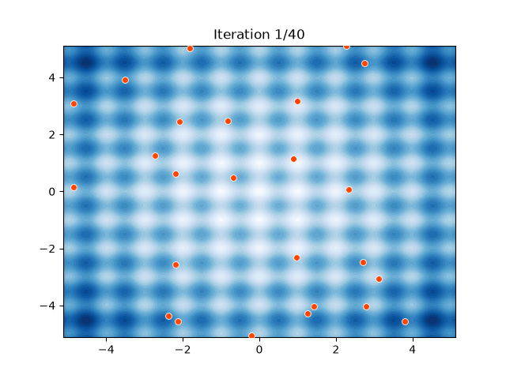

<p align="center">
  
</p>

<p align="center">
  <a href="https://pypi.org/project/turboswarm/"></a>
  <a href="https://crates.io/crates/turboswarm-core"></a>
  <a href="https://github.com/turboswarm/turboswarm.github.io/actions/workflows/ci.yml"></a>
  <a href="https://turboswarm.github.io/"></a>
  
  
  <a href="https://doi.org/10.5281/zenodo.20832446"></a>
</p>

# turboswarm

A general-purpose, extensible **Particle Swarm Optimization (PSO)** library with
a **Rust** core, valid for **real, integer and mixed** variables. Its design
priorities are visualization, algorithm comparison and code clarity.

Usable directly from **Rust** and from **Python** (via PyO3 + maturin).

<p align="center">
  
  <br>
  <em>A 30-particle swarm converging on the Rastrigin minimum — rendered with <code>turboswarm.viz</code>.</em>
</p>

```python
import turboswarm as pso
r = pso.minimize("rastrigin", bounds=(-5.12, 5.12), dim=2, seed=42)
print(r.best_value)        # ≈ 0.0
```

## What it includes

- **Velocity variants:** inertia (Shi-Eberhart), constriction (Clerc-Kennedy)
  and FIPS (Fully Informed PSO).
- **Topologies:** global (gbest), ring (lbest), Von Neumann (2D grid) and random.
- **Spaces:** continuous (real), integer (with a discretization strategy),
  binary, **mixed** (per-dimension type) and **grey / interval** (uncertain
  values, optimized over their centre and spread).
- **Multi-objective (MOPSO):** Pareto front via an external archive with a
  turbulence operator, **crowding-distance or Coello's adaptive grid** for
  diversity, and a **hypervolume** quality metric.
- **Constraints:** inequality **and equality** constraints via a penalty, plus
  an optional **repair** operator that maps candidates back to the feasible set.
- **Run control:** stop on target value, evaluation budget, wall-clock budget
  or stagnation; per-iteration callback; the result reports `stop_reason` and
  `evaluations`.
- **Boundary handling:** clamp, reflect, wrap or reinit.
- **Performance:** velocity clamp (`v_max`), parallel evaluation (`rayon`) and a
  vectorized/batched objective path.
- **Hyperparameter sensitivity:** `sweep` runs a Cartesian product of
  hyperparameter values (aggregated over seeds) to see what matters.
- **Benchmarks:** sphere, rastrigin, rosenbrock, ackley, griewank, schwefel and
  the **CEC-family** functions (bent cigar, discus, elliptic, zakharov, levy,
  expanded Schaffer) — each with metadata (recommended bound, known optimum).
- **Visualization** (Python): convergence curves, variant comparison, 2D swarm
  animation, **3D landscape + animated 3D swarm**, Pareto-front and sensitivity
  plots.
- **Integrations** (`turboswarm.integrations`): a **SciPy** drop-in
  (`scipy.optimize.minimize`), **scikit-learn** `PSOSearchCV`, an **Optuna**
  sampler, **pandas** export, **Joblib/Dask** parallel objectives, and an
  **LLM agent tool** (LangChain / LangGraph).
- **Reproducibility:** every experiment accepts a `seed`.

## Status by phase

| Phase | Content | Status |
|------|-----------|--------|
| 1 | Rust core: continuous+integer spaces, inertia, gbest, history, benchmarks, tests | ✅ |
| 2 | More variants (constriction, FIPS), topologies (ring, Von Neumann, random), benchmarks | ✅ |
| 3 | Python bindings (PyO3 + maturin) — `import turboswarm` API | ✅ |
| 4 | Visualization (`viz`) + example notebooks | ✅ |
| 5 | Constraints, mixed variables, run control, boundary handling, parallel/vectorized | ✅ |
| 6 | Multi-objective optimization (MOPSO) | ✅ |

See [`ROADMAP.md`](ROADMAP.md) for the task breakdown.

## Quick start (Rust)

```bash
cargo test -p turboswarm-core           # runs the suite (convergence tests + doctest)
cargo run --example basic -p turboswarm-core
```

```rust
use turboswarm_core::prelude::*;
use turboswarm_core::benchmarks::rastrigin;

let space = ContinuousSpace::uniform(2, -5.12, 5.12);   // same range on every dim
let velocity = InertiaVelocity::new(0.9, 1.49445, 1.49445).with_decay(0.4);
let params = PsoParams { seed: Some(42), ..Default::default() };

let result = Pso::new(space, velocity, GlobalBest::new(), params)
    .minimize(rastrigin);

println!("{:?} -> {}", result.best_position, result.best_value);
```

## Quick start (Python)

```bash
python -m venv .venv && source .venv/bin/activate
pip install maturin matplotlib numpy
maturin develop --release        # compiles the Rust core and installs it
python examples/quickstart.py
```

```python
import turboswarm as pso

# Native benchmark (runs in Rust, without the GIL).
# bounds: a single (min, max) for every dimension -> pass dim
r = pso.minimize("rastrigin", bounds=(-5.12, 5.12), dim=2, seed=42)

# Variant and topology by name
r = pso.minimize("ackley", bounds=(-32.768, 32.768), dim=2,
                 velocity="fips", topology="ring", seed=1)

# Or one (min, max) per dimension (different ranges); your own fn; integers
r = pso.minimize(lambda x: (x[0] - 1) ** 2 + (x[1] - 50) ** 2, bounds=[(-5, 5), (0, 100)])
r = pso.minimize(f, bounds=(-10, 10), dim=2, integer=True)

print(r.best_position, r.best_value)
```

## The design idea (extensibility)

The PSO loop knows nothing about any variant. Everything that changes lives behind
three traits in [`crates/turboswarm-core/src/traits.rs`](crates/turboswarm-core/src/traits.rs):

- `SearchSpace` — the domain; the integer/real difference lives here (`decode`).
- `Velocity` — the update rule; **one variant = one impl** of this
  trait. It receives an `UpdateContext` with the neighborhood best and, for fully
  informed variants (FIPS), the `pbest` of the entire neighborhood.
- `Topology` — the social structure of the swarm. It is defined by its
  `neighbors(i)` method; `best_neighbor` is derived by default.

To create a new variant, implement `Velocity` and expose it by name in
the binding. See `velocity/inertia.rs` as a template and the "How to
extend" section of [`CLAUDE.md`](CLAUDE.md).

## Documentation

A navigable documentation portal (narrative guide + Python API reference) is
built with MkDocs Material and published to **GitHub Pages**:
<https://turboswarm.github.io/> *(live once Pages is enabled)*.

Build it locally:

```bash
pip install -e ".[docs]"          # mkdocs-material + mkdocstrings
./scripts/build-docs.sh --serve   # live portal at http://127.0.0.1:8000
./scripts/build-docs.sh           # build to site/ and the Rust API to target/doc/
```

The narrative sources live in [`docs/`](docs/); the Python API is generated
from docstrings via `mkdocstrings`. The Rust API is generated separately with
rustdoc (`cargo doc -p turboswarm-core --no-deps --open`) and, once published, will be
available on docs.rs.

**Deployment:** [`.github/workflows/docs.yml`](.github/workflows/docs.yml)
builds the package (so `mkdocstrings` can import it) and deploys on every push
to `main`. Enable it once in **Settings → Pages → Source: GitHub Actions**.

## Releasing

CI runs `cargo fmt`/`clippy`/tests and the Python tests on every push and PR
([`ci.yml`](.github/workflows/ci.yml)). Pushing a version tag publishes:

```bash
git tag v0.1.0 && git push --tags
```

- **PyPI** (`turboswarm`): [`release-pypi.yml`](.github/workflows/release-pypi.yml)
  builds abi3 wheels (one per platform, CPython ≥ 3.9) + sdist and uploads using
  the `PYPI_API_TOKEN` secret.
- **crates.io** (`turboswarm-core`): [`release-crates.yml`](.github/workflows/release-crates.yml)
  runs `cargo publish` — needs a `CARGO_REGISTRY_TOKEN` secret.

## Structure

```
crates/turboswarm-core/   Rust core (zero-cost generics, no FFI)
crates/pso-py/     PyO3 bindings (native module turboswarm_native)
python/turboswarm/     Python API: __init__, pure benchmarks, viz (matplotlib)
notebooks/         example notebooks
examples/          Rust (basic) and Python (quickstart.py) examples
```

## License

MIT. See [`LICENSE`](LICENSE).
