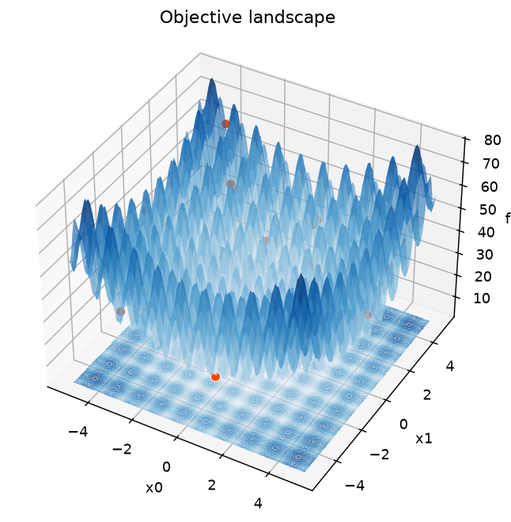
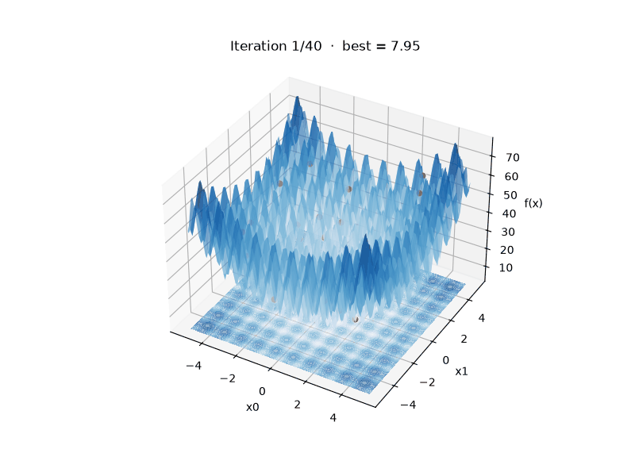

# Visualization

Visualization is the project's first priority. The `turboswarm.viz` module consumes
a `PsoResult` and uses matplotlib. Because `record_history=True` by default,
every run is ready to animate.

!!! note
    `viz` imports matplotlib lazily, and the example scripts keep visualization
    optional (behind `--plot` / `--animate`), so the core runs without it.

## Convergence curve

```python
import matplotlib.pyplot as plt
import turboswarm as pso

r = pso.minimize("rastrigin", bounds=[(-5.12, 5.12)] * 2, seed=1)
pso.viz.plot_convergence(r)
plt.show()
```

## Comparing variants

`compare` takes a dict `{name: PsoResult}` and overlays their convergence
curves:

```python
runs = {
    "inertia/global": pso.minimize("rastrigin", bounds=[(-5.12, 5.12)] * 2,
                                   velocity="inertia", topology="global", seed=7),
    "fips/ring": pso.minimize("rastrigin", bounds=[(-5.12, 5.12)] * 2,
                              velocity="fips", topology="ring", seed=7),
}
pso.viz.compare(runs)
plt.show()
```

## Animating the swarm (2D)

```python
r = pso.minimize("rastrigin", bounds=[(-5.12, 5.12)] * 2, seed=1)
anim = pso.viz.animate_swarm(r, pso.benchmarks.rastrigin, [(-5.12, 5.12)] * 2)
plt.show()
# In a notebook:  from IPython.display import HTML; HTML(anim.to_jshtml())
# Save a GIF:      from matplotlib.animation import PillowWriter
#                  anim.save("swarm.gif", writer=PillowWriter(fps=10))
```

`animate_swarm` only supports 2D problems and requires `record_history=True`.


The GIF above is produced by [`scripts/make_swarm_gif.py`](https://github.com/turboswarm/turboswarm.github.io/blob/main/scripts/make_swarm_gif.py).

## 3D landscape and swarm

For a more striking view, render the objective as a **3D surface**. Pass the
final swarm to `plot_surface` to drop the particles onto the landscape:

```python
r = pso.minimize("rastrigin", bounds=[(-5.12, 5.12)] * 2, seed=3)
pso.viz.plot_surface(pso.benchmarks.rastrigin, [(-5.12, 5.12)] * 2,
                     points=r.history[-1])
plt.show()
```



`animate_swarm_3d` turns it into an animation: the particles fly over the
surface, the **best-so-far** is marked with a gold star, and the camera slowly
rotates.

```python
anim = pso.viz.animate_swarm_3d(r, pso.benchmarks.rastrigin, [(-5.12, 5.12)] * 2)
plt.show()
# Save a GIF:  anim.save("swarm3d.gif", writer="pillow", fps=10)
```



Both 3D helpers support **2D problems** (the surface is `f(x0, x1)`); the
animation needs `record_history=True`. Tune the look with `cmap`, `resolution`,
`elev`/`azim` (static) or `rotate=False` (animation).

## High-dimensional swarms (3D projection)

`plot_surface` / `animate_swarm_3d` draw a true landscape, so they are for 2D
problems. For **more than two dimensions**, `animate_swarm_projected` projects
each particle to 3D — with PCA (default, fit over the whole run so the view is
stable) or by picking three dimensions — and colors particles by their objective
value when you pass the function:

```python
r = pso.minimize("rastrigin", bounds=[(-5.12, 5.12)] * 8, seed=2)   # 8-D

# PCA projection, colored by objective:
pso.viz.animate_swarm_projected(r, function=pso.benchmarks.rastrigin)

# or pick three dimensions explicitly:
pso.viz.animate_swarm_projected(r, dims=(0, 3, 5))
```

## Interactive plots (Plotly)

For zoom/hover/pan in notebooks and on the web, the `plotly_*` helpers return a
Plotly figure (install `pip install turboswarm[plotly]`):

```python
pso.viz.plotly_convergence(r).show()
pso.viz.plotly_compare({"inertia": rA, "fips": rB}).show()
pso.viz.plotly_pareto(front).show()
```

## Exporting the run (CSV / Parquet)

Export the per-iteration history or the convergence curve for analysis elsewhere
(needs `pip install turboswarm[pandas]`, or `[parquet]` for Parquet):

```python
from turboswarm.integrations import pandas as ts_pandas

ts_pandas.to_csv(r, "history.csv")                       # one row per (iter, particle)
ts_pandas.to_csv(r, "convergence.csv", kind="convergence")
ts_pandas.to_parquet(r, "history.parquet")
# or get DataFrames directly: ts_pandas.history_dataframe(r) / convergence_dataframe(r)
```

## Sensitivity plots

See [Sensitivity analysis](sensitivity.md) for `viz.plot_sensitivity` (a line
for one swept hyperparameter, a heatmap for two).

## Logging

`turboswarm` follows library conventions: it attaches a `NullHandler` and never
configures logging itself. Turn on log output from your application:

```python
import logging
logging.basicConfig(level=logging.INFO)
# viz then logs run comparisons and animation frame counts on the
# "turboswarm.viz" logger.
```

## Ready-made demo

```bash
python examples/demo_viz.py        # compares variants, then animates
python examples/tour.py --animate  # full tour + optional animation
```
