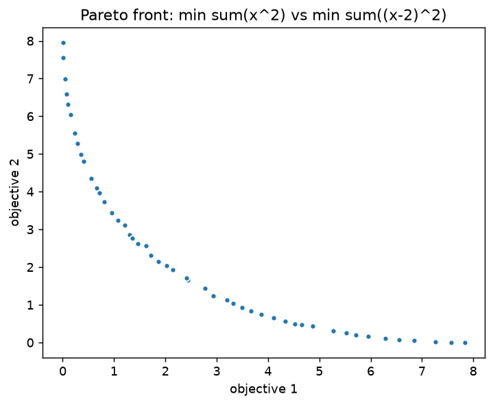

# Multi-objective optimization

When objectives conflict there is no single best solution but a set of
trade-offs — the **Pareto front**. This tutorial finds and visualizes that front
with `minimize_multi` (MOPSO).

## The problem

Two conflicting objectives over `x ∈ ℝ²`: one pulls `x` toward `0`, the other
toward `2`. No single point minimizes both, so the answer is a front of
compromises.

$$f_1(x) = \sum_i x_i^2 \qquad f_2(x) = \sum_i (x_i - 2)^2$$

```python
import turboswarm as pso

front = pso.minimize_multi(
    lambda x: [sum(xi ** 2 for xi in x), sum((xi - 2) ** 2 for xi in x)],
    bounds=[(-5, 5)] * 2,
    n_particles=100, max_iter=100, archive_size=50, seed=42,
)

print(len(front))            # 50 non-dominated solutions
front.positions              # list[list[float]] — decision vectors
front.objectives             # list[list[float]] — [f1, f2] per solution
```

The objective returns a **list** of values (all minimized). `minimize_multi`
keeps an external archive of non-dominated solutions; `archive_size` caps how
many are returned.

## Inspect the front

The front spans the full trade-off, from minimizing `f1` to minimizing `f2`:

```python
import numpy as np

objs = np.array(front.objectives)
print(objs[:, 0].min(), objs[:, 0].max())   # f1 ranges 0.00 .. 7.83
print(objs[:, 1].min(), objs[:, 1].max())   # f2 ranges 0.00 .. 7.95
```

## Visualize it

For two objectives, `viz.plot_pareto` draws the front in objective space:

```python
import matplotlib.pyplot as plt

pso.viz.plot_pareto(front)
plt.show()
```



Each point is a non-dominated compromise: you cannot improve one objective
without worsening the other.

## Measure front quality: hypervolume

A single number that rewards both convergence and spread is the **hypervolume**
— the volume of objective space dominated by the front, bounded by a reference
point (larger is better for minimization):

```python
hv = front.hypervolume([8.0, 8.0])   # explicit reference point
print(f"{hv:.3f}")                    # 52.665
```

To compare two fronts (e.g. different settings), pass them the **same**
reference point. See the [Multi-objective guide](../guide/multiobjective.md) for
the crowding-vs-grid archive options and more metrics.

## Next steps

- Switch the archive to Coello's adaptive grid with `grid_divisions=` for a more
  evenly spread front.
- Multi-objective search works with integer/mixed spaces too — combine this with
  the [integer & mixed tutorial](integer-mixed.md).
