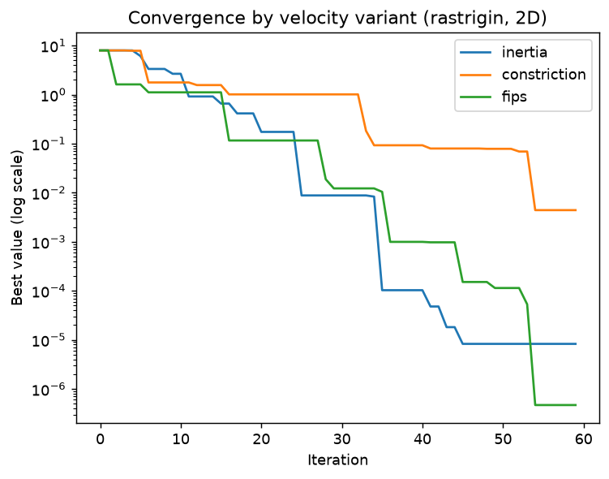

# Visualizing and animating a swarm

Visualization is `turboswarm`'s top priority. This tutorial records a run and
turns it into a convergence curve, a variant comparison, and an animation of the
swarm moving over the objective landscape.

Visualization uses Matplotlib (a core dependency), so there is nothing extra to
install.

## Record the run

Plots and animations need the per-iteration history, which is recorded by
default (`record_history=True`). We optimize the 2-D
[Rastrigin](../guide/benchmarks.md) function — a classic multimodal test case.

```python
import turboswarm as pso

bounds = [(-5.12, 5.12)] * 2
result = pso.minimize("rastrigin", bounds=bounds, seed=3, max_iter=60)
print(f"{result.best_value:.3e}")     # 8.286e-06  (optimum is 0)
```

## Plot convergence

`viz.plot_convergence` draws the global best value per iteration (log scale by
default):

```python
import matplotlib.pyplot as plt

pso.viz.plot_convergence(result)
plt.show()
```

## Compare variants on one chart

Run the same problem with different velocity rules and overlay their curves —
this is the quickest way to see which variant converges fastest:

```python
runs = {
    v: pso.minimize("rastrigin", bounds=bounds, velocity=v, seed=3, max_iter=60)
    for v in ["inertia", "constriction", "fips"]
}

ax = None
for name, r in runs.items():
    ax = pso.viz.plot_convergence(r, label=name, ax=ax)
ax.set_title("Convergence by velocity variant (rastrigin, 2D)")
plt.show()

for name, r in runs.items():
    print(name, f"{r.best_value:.3e}")
# inertia       8.286e-06
# constriction  4.412e-03
# fips          4.692e-07
```



On this problem and seed all three reach the optimum region; `fips` and
`inertia` get closest. Comparing variants under identical conditions like this
is exactly what the library is designed for.

## Animate the swarm

For 2-D problems, `viz.animate_swarm` draws the particles moving over a contour
of the objective. It returns a Matplotlib animation you can display in a
notebook or save to a file:

```python
anim = pso.viz.animate_swarm(result, "rastrigin", bounds)
anim.save("swarm.gif", fps=10)        # or display it inline in a notebook
```


The particles start scattered and contract toward the global optimum at the
origin as the iterations progress.

!!! note
    `animate_swarm` supports **2-D** problems and needs `record_history=True`
    (the default). For higher dimensions, plot convergence instead, or project
    to two dimensions before animating.

## A 3D view of the landscape

For a more striking picture, render the objective as a 3D surface and drop the
final swarm onto it with `plot_surface`:

```python
pso.viz.plot_surface(pso.benchmarks.rastrigin, bounds, points=result.history[-1])
plt.show()
```


`pso.viz.animate_swarm_3d(result, pso.benchmarks.rastrigin, bounds)` animates the
swarm flying over this surface, with the best-so-far marked by a gold star and a
slowly rotating camera — see the [Visualization guide](../guide/visualization.md#3d-landscape-and-swarm).

## Next steps

- For multi-objective runs, [`viz.plot_pareto`](../guide/multiobjective.md)
  draws the trade-off front.
- To study how hyperparameters affect results, see
  [Sensitivity analysis](../guide/sensitivity.md) and `viz.plot_sensitivity`.
